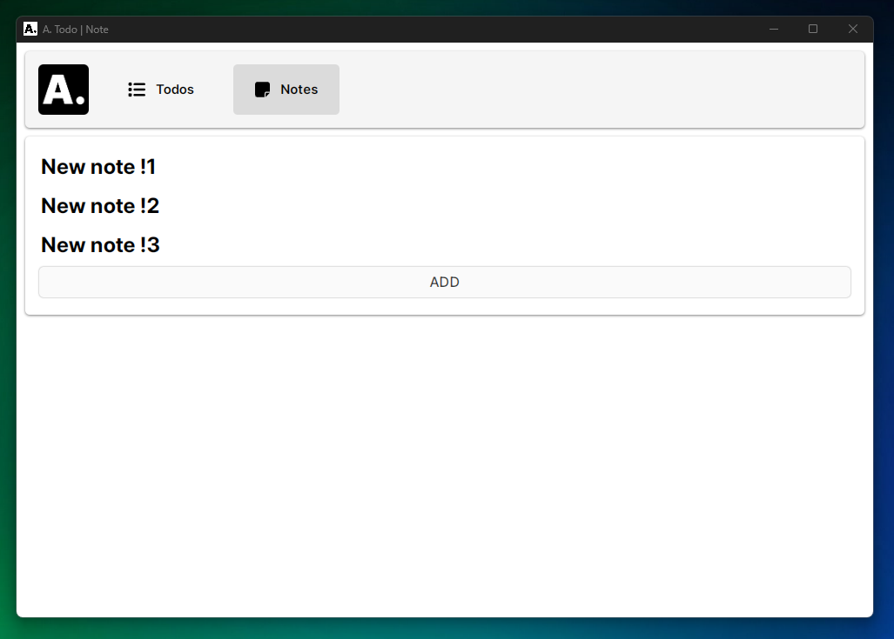
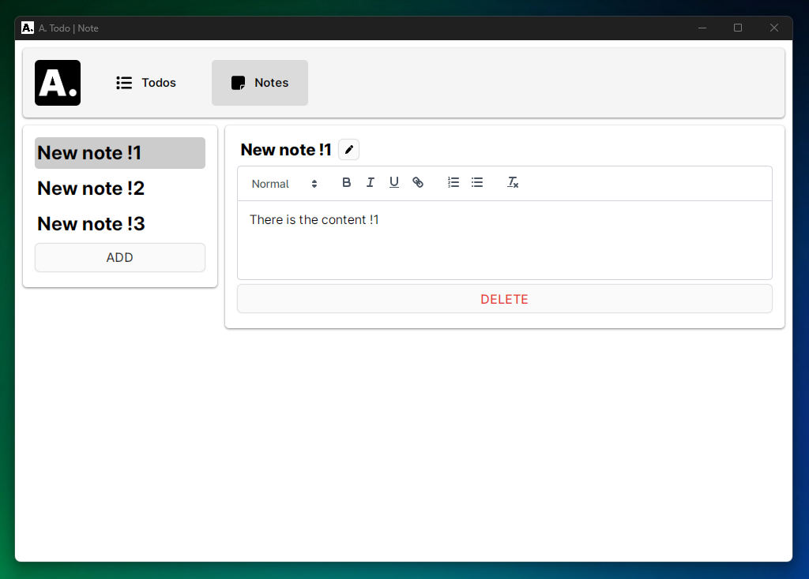
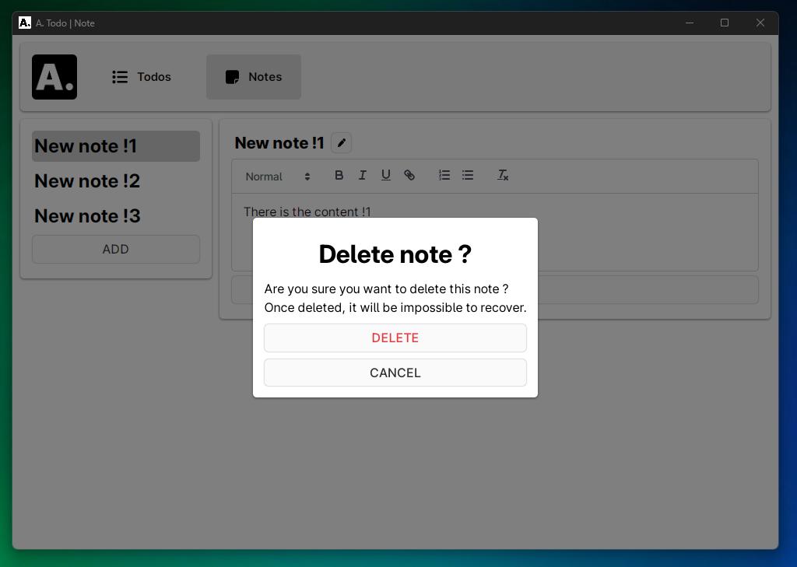

# Note | Todo application

Note and Todo applicaiton build with **Vue3** + **Electron** TypeScript based application, including **ViteJS** and **Electron Builder**.

## Preview






### Install dependencies ⏬

```bash
npm install
```

### Start developing ⚒️

```bash
npm run dev
```

## Additional Commands

```bash
npm run build:win # uses windows as build target
npm run build:mac # uses mac as build target
npm run build:linux # uses linux as build target
```

## Project Structure

```bash
- scripts/ # all the scripts used to build or serve
- src/
  - main/ # Electron application source
  - renderer/ # VueJS application source
```
